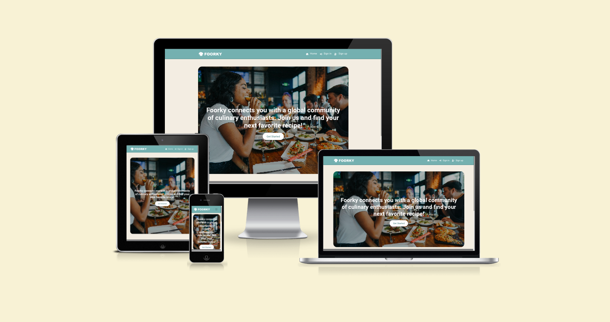
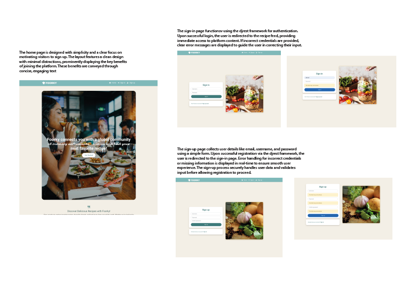
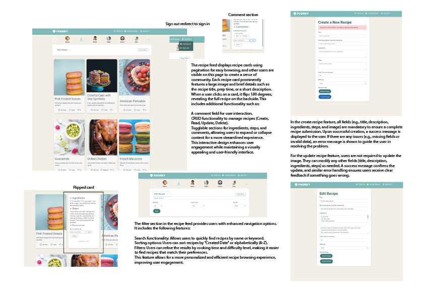
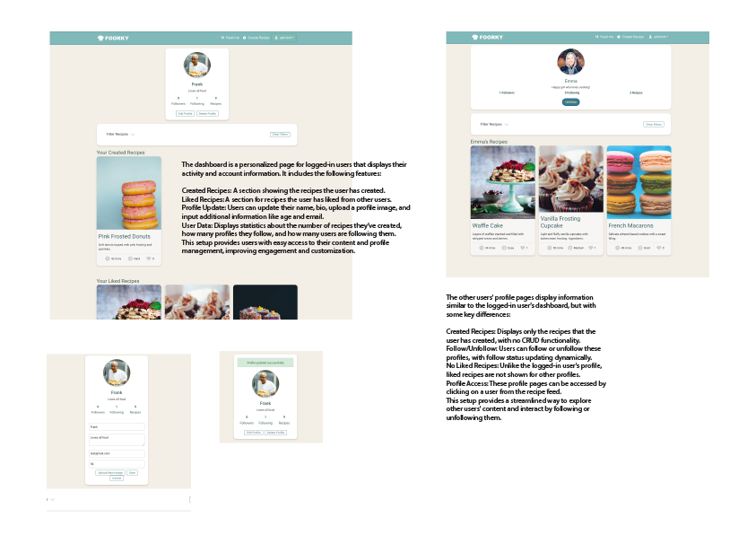
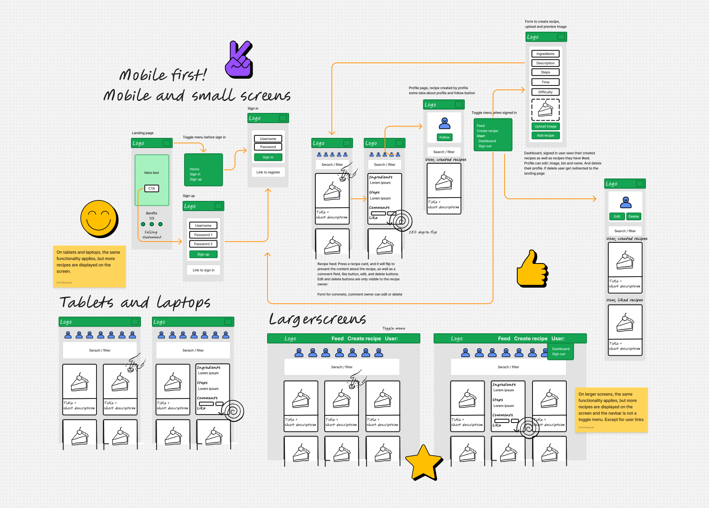
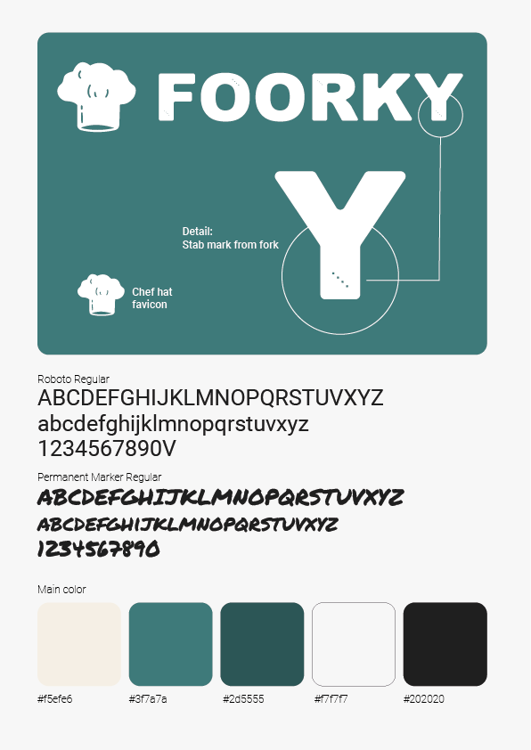
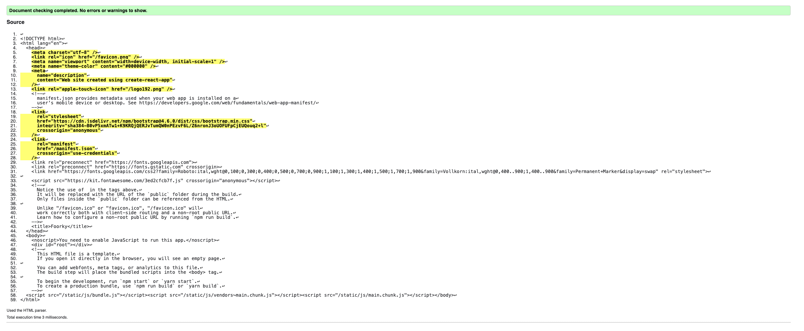
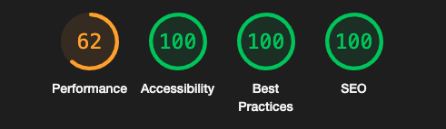

# Foorky 2.0 - Frontend

**Foorky 2.0** is an advanced full-stack web application designed to help users manage and share their favorite recipes. This frontend serves as the user interface for interacting with the Foorky backend API, enabling users to browse, create, and manage recipes, follow other users, like recipes, and leave comments.

[Deployed app](https://foorky-fe-79ffc00345fc.herokuapp.com)

[Deployed backend api](https://project5-api-a299de19cbb3.herokuapp.com)

[Repository Frontend](https://github.com/davidb3rgqvist/project5-foorky)

[Repository Backend](https://github.com/davidb3rgqvist/project5_api)

## Table of Contents

- [Project Overview](#project-overview)
- [UX Design](#ux-design)
- [Key Features](#key-features)
- [Future Features](#Future-features)
- [Technology Stack](#technology-stack)
- [Installation](#installation)
- [Usage](#usage)
- [Reusable React Components](#reusable-react-components)
- [API Integration](#api-integration)
- [Responsive Design](#responsive-design)
- [Testing](#testing)
- [Deployment](#deployment)
- [Bug Fixes](#bug-fixes)
- [Credits](#credits)

## Project Overview

The frontend of **Foorky 2.0** is built using **React.js** and **React Bootstrap**, following best practices in component-based architecture. This frontend is designed to be scalable, modular, and efficient, making use of reusable components and ensuring an excellent user experience across multiple devices.

The frontend connects to the **Foorky 2.0** backend, which is a Django REST API, using secure authentication mechanisms and performs all operations like recipe creation, management, and user interactions.

## Understanding Agile Project Management

In this project, I have followed the principles of **Agile Project Management**. Agile emphasizes iterative development. User stories, acceptance criteria, and key features are developed incrementally, ensuring that the product evolves. By breaking down the project into user stories, I ensure a focus on delivering value in small, manageable increments.

[Kanban board](https://github.com/users/davidb3rgqvist/projects/7/views/1)

Below is a table summarizing the user stories, components, and acceptance criteria for the project:

| Category     | User Story                                                                                  | Acceptance Criteria                                                                                                          | Key Components                                    |
|--------------|---------------------------------------------------------------------------------------------|-----------------------------------------------------------------------------------------------------------------------------|--------------------------------------------------|
| UI Components| As a user, I want to register for an account so that I can have a personal profile with a picture and bio | Users can register, upload a profile picture, and edit bio after signing up.                                                 | SignUpForm, ProfilePage, ProfileEditForm          |
| UI Components| As a user, I want to register for an account so that I can create, like, and comment on recipes | Users can register and access recipe creation, like, and comment functionality.                                              | Recipe, RecipePage, Comment                      |
| UI Components| As a user, I want to register for an account so that I can follow other users and their recipes | Registered users can follow/unfollow others, and the follow button is available on profiles.                                 | Profile, ProfilePage                             |
| Recipes      | As a visitor, I want to view a list of recipes so that I can browse the most recent recipe uploads | A recipe feed displays recent uploads with titles, images, and descriptions.                                                 | RecipesPage                                      |
| Recipes      | As a visitor, I want to view an individual recipe so that I can see user feedback, i.e., likes and comments | Clicking on a recipe shows detailed information, with likes and comments.                                                   | Recipe, RecipePage                               |
| Recipes      | As a visitor, I want to search a list of recipes so that I can find a recipe by a specific ingredient, cuisine, or title | A search bar filters recipes by ingredient, title, or cuisine, with dynamic results.                                         | RecipesPage, SearchBar                           |
| Recipes      | As a visitor, I want to scroll through a list of recipes so that I can browse the site more comfortably | Infinite scrolling loads more recipes as the user scrolls, with pagination/loading indicators.                               | InfiniteScrollComponent                          |
| Recipes      | As a user, I want to edit and delete my recipe so that I can correct or hide any mistakes in my recipe | Edit and delete options are only visible to the recipe owner, and changes are reflected immediately.                         | RecipeEditForm, MoreDropdownMenu                 |
| Recipes      | As a user, I want to create a recipe so that I can share my favorite meals with others          | A form allows users to input recipe details and upload an image, with the recipe visible after submission.                    | RecipeCreateForm                                 |
| Recipes      | As a user, I want to view liked recipes so that I can go back to my favorite recipes easily      | Liked recipes are accessible from the profile or a dedicated section.                                                        | RecipesPage, LikedRecipesSection                 |
| Recipes      | As a user, I want to view followed users' recipes so that I can keep up with my favorite users' recipes | Recipes from followed users appear in a separate feed or section.                                                            | RecipesPage, FollowingRecipesSection             |
| Likes        | As a user, I want to like a recipe so that I can express my appreciation for a recipe            | Clicking the like button increments the like counter, and a user can only like a recipe once.                                | RecipeLikeIcon                                   |
| Likes        | As a user, I want to unlike a recipe so that I can express that my interest in the recipe has faded | Clicking the unlike button decrements the like counter.                                                                     | RecipeUnlikeIcon                                 |
| Comments     | As a user, I want to create a comment so that I can share my thoughts on a recipe                 | The comment form is available on the recipe page, and comments appear in real-time after submission.                         | RecipePage, CommentCreateForm                    |
| Comments     | As a user, I want to edit and delete my comment so that I can correct or hide any mistakes in my comment | Edit and delete options are available for the user's own comments.                                                          | RecipePage, Comment, MoreDropdownMenu            |
| Profiles     | As a user, I want to view a profile so that I can see a user's recent recipes, followers, following count, and liked recipes | The profile page displays user-specific data, including recipes, followers, and following details.                           | ProfilePage, Recipe                              |
| Profiles     | As a user, I want to edit my profile so that I can update my profile information                 | The profile edit form allows the user to update their name, bio, and profile image.                                           | ProfileEditForm                                  |
| Followers    | As a user, I want to follow a profile so that I can show my interest in someone's recipes         | Clicking the follow button toggles to unfollow, and updates the follower count in real-time.                                  | ProfileFollowButton                              |
| Followers    | As a user, I want to unfollow a profile so that I can express that my interest has faded          | Clicking the unfollow button removes the user’s recipes from the following feed, and the status persists across sessions.     | ProfileUnfollowButton                            |

## UX Design

### Strategy:
Foorky 2.0 is a full-stack recipe management platform designed to make storing and discovering culinary recipes seamless for both amateur cooks and professional chefs. The platform focuses on delivering a user-friendly experience while fostering community engagement through collaboration, interaction, and recipe sharing.

**User Goals:**
- **Recipe Organization**: Users want an efficient and intuitive system for storing, categorizing, and retrieving their recipes.
- **Easy Access and Management**: Users seek a simple way to access and manage their recipes anytime, with convenient tools for updates and edits.
- **Community and Collaboration**: Users want to share recipes, get feedback, and interact with other users in the culinary community.

**Owner Goals:**
- **User Engagement**: Create an engaging, feature-rich platform that retains users and keeps them coming back to explore and contribute.
- **Community Growth**: Foster an environment where users can build a community around their culinary interests, collaborating through recipes and discussions.
- **Platform Expansion**: Ensure steady platform growth by delivering value and satisfaction, attracting new users, and maintaining a loyal user base.

### Scope:
**Core Features:**
- **Recipe Management**: Users can add, update, categorize, and delete recipes in their personal collection.
- **Social Features**: Provide options to follow other users, like recipes, and leave comments.
- **Search and Filter**: Allow users to find recipes based on keywords, categories, difficulty, or cooking time.

**Additional Features:**
- **Recipe Sharing**: Enable users to share their favorite recipes with friends and other users.
- **Customization**: Users can add personal notes, like, and save favorite recipes for quick access in the dashboard.

### Structure:
**Core Pages:**
- **Recipe Dashboard**: A hub for users to view and manage their recipe collections, with quick access to their created recipes, and liked recipes.
- **Recipe Entry Form**: A structured, user-friendly form for adding new recipes, with fields for title, ingredients, instructions, and images.
- **Search and Filter**: Advanced search and filter options help users navigate recipes by various categories (e.g., difficulty, cook time, rating).
- **Recipe Details**: A detailed view of a recipe, including ingredients, steps, user comments, and the option to like or share.
- **Profile Pages**: Each user has a profile displaying their created recipes, follower count, and other user information.
  
**Key Interactions:**
- **Create Recipe Button**: Allows users to initiate the process of adding a new recipe.
- **Edit/Delete Recipe**: Users can easily edit or delete recipes from a recipe card.
- **Follow Users**: Users can follow other culinary enthusiasts.
- **Like and Comment on Recipes**: Social interaction features to engage with content from other users.

### Skeleton:
- **Create Recipe Flow**: A clear, step-by-step process with easy navigation for adding a new recipe, including fields for title, ingredients, steps, and an image.
- **Dashboard Layout**: A responsive grid layout that allows users to easily navigate between their created and liked recipes.
- **Search Bar and Filters**: At the top of the recipe dashboard, a search bar allows for quick lookups, while advanced filters enable recipe sorting by category, cooking time, and more.
- **Recipe Cards**: Each recipe is presented as a card with a title, image on the front. When flipped user find the instruction and interaction buttons (like, comment, etc.) for intuitive engagement.
- **Like/Comment Actions**: Each recipe card features buttons to like, comment the recipe.

### Surface:
- **Modern UI Design**: The overall visual design uses clean, flat design principles with an emphasis on readability, intuitive interactions, and an aesthetically pleasing user experience.
- **Color Scheme**: The color palette features earthy tones like green, white, and beige, creating a calming, inviting atmosphere.
- **Typography**: Roboto and Vollkorn fonts are used to combine modern and classic aesthetics, enhancing readability and creating a professional yet friendly feel.

**Key Visual Components:**
- **Hero Section**: A large hero section on the homepage welcoming users and featuring a call-to-action to sign-up.
- **Buttons and CTAs**: Rounded buttons with hover effects guide users through key actions like creating, liking, and sharing recipes.
- **Mobile Responsiveness**: The entire interface is designed to scale and adapt fluidly across devices, ensuring a smooth experience on desktops, tablets, and mobile devices.

## Key Features

- **User Authentication**: Secure login, logout, and registration using JWT tokens.
- **Recipe Management**: Full CRUD (Create, Read, Update, Delete) functionality for managing user recipes.
- **Comments and Likes**: Users can comment on recipes and like them.
- **Followers and Following**: Users can follow other users to view their recipes and grow their network of culinary enthusiasts.
- **Responsive Design**: The application works smoothly on various devices, from desktops to mobile phones.
- **Search and Filtering**: Users can search for recipes by keyword and filter them based on difficulty, cook time, and other parameters.
- **Profile Management**: Users can update their profiles, upload profile pictures, and view profiles of other users.

## Future Features

The Foorky 2.0 frontend has a robust set of features, but there are several enhancements that could be added in future iterations to improve user experience and engagement:

- **Notification System for Followers**: Implement a feature where users receive notifications when someone they follow creates a new recipe. This would help drive engagement and keep users updated on their favorite chefs' latest creations.
- **Recipe Rating System**: Allow users to rate recipes on a scale (e.g., 1 to 5 stars), providing more granular feedback in addition to likes.
- **Social Sharing Options**: Add buttons that allow users to easily share their favorite recipes on social media platforms such as Facebook, Twitter, and Instagram.
- **Recipe Video Integration**: Enable users to upload short video clips along with their recipes, offering step-by-step instructions in a visual format.
- **Dark Mode**: Introduce a dark mode option to enhance user accessibility and allow for a more comfortable viewing experience, especially at night.
- **Saved Recipes Feature**: Allow users to bookmark or "save" their favorite recipes to a personal collection for easy access later.
- **Advanced Search Filters**: Expand the filtering options to include more parameters such as dietary preferences (vegan, gluten-free, etc.), cuisine type, and preparation time.
- **In-app Messaging**: Create a feature where users can message each other to share tips, collaborate on recipes, or discuss culinary ideas.
- **Weekly Recipe Suggestions**: Based on user preferences and previous interactions, the app could suggest new recipes weekly, tailoring suggestions to user tastes and cooking habits.

## Technology Stack

- **React.js**: Main framework for building the frontend interface.
- **React Bootstrap**: For UI components and styling.
- **Axios**: For handling API requests.
- **React Router**: For managing client-side routing.
- **CSS Modules**: For scoped and maintainable styling.
- **Font Awesome**: For icons and UI enhancements.
- **Context API**: For global state management, including user authentication and profile data.

## Installation

### 1. Clone the Repository

git clone https://github.com/davidb3rgqvist/project5-foorky

### 2. Install Dependencies

Ensure you have Node.js installed, then install the required dependencies:

npm install

### 3. Set Up Environment Variables

Create a `.env` file in the root directory and add the following environment variables:

REACT_APP_BACKEND_URL=https://your-backend-url
REACT_APP_CLOUDINARY_URL=cloudinary://your-cloudinary-api-key
REACT_APP_AUTH_TOKEN_KEY=my-app-auth

### 4. Run the Development Server

Once the installation is complete, you can start the app:

npm start

## Usage

- **Login or Sign up**: Users need to sign in or register to create recipes, follow other users, and leave comments.
- **Create Recipes**: After logging in, users can create and manage their own recipes, including adding ingredients, steps, and images.
- **Search and Filter**: Use the search bar and filtering options to find recipes based on keywords, difficulty level, or cook time.
- **View Profiles**: Users can view their own profiles or visit other users' profiles to see their recipes and follow them.
- **Like and Comment*: Interact with the community by liking recipes and leaving comments.

## API Integration

The frontend communicates with the backend via the Foorky 2.0 API. All data is fetched using `axios` with secure JWT token authentication. Key API endpoints include:

- **Authentication**: `/dj-rest-auth/login/`, `/dj-rest-auth/logout/`, `/dj-rest-auth/registration/`
- **Recipes**: `/recipes/` (GET, POST, PUT, DELETE)
- **Profiles**: `/profiles/` (GET, PUT)
- **Likes**: `/likes/` (POST, DELETE)
- **Followers**: `/followers/` (POST, DELETE)

The backend uses Django REST Framework, and more details about the endpoints can be found in the backend README.

## Reusable React Components

### 1. ProfileCard
The `ProfileCard` component displays user profile information such as followers, following count, and the number of recipes the user has created. It includes:

- **File Upload**: Allows users to upload and update their profile picture.
- **Form Management**: Users can edit profile information such as name, bio, and email.
- **Success/Error Messages**: Provides visual feedback after successful updates or when an error occurs.

### Key Functionalities:
- Editing and deleting the profile.
- Displays important metrics such as followers and created recipes.
- Mobile-responsive design for various screen sizes.

### Props:
- `user` (object): The current user data.
- `onEdit` (function): Callback to handle profile edits.
- `onDelete` (function): Callback to handle profile deletion.

---

### 2. FilterSearchCard
The `FilterSearchCard` component is designed for filtering and searching recipes. It includes:

- **Search Bar**: Allows users to search for recipes by name or keyword.
- **Filters**: Users can filter by difficulty level and cook time.
- **Sorting Options**: Sorts recipes by created date or alphabetically (A-Z).

### Key Functionalities:
- Easy integration with any recipe data feed.
- Fully customizable filters for search queries.
- Responsive design ensuring a smooth user experience across devices.

### Props:
- `onSearch` (function): Callback for handling search queries.
- `onFilterChange` (function): Callback for updating filter selections.
- `onSortChange` (function): Callback for updating sort order.

---

## 3. RecipeCard
The `RecipeCard` component displays detailed information about a recipe. It includes:

- **Image Display**: Shows a large recipe image.
- **Flip Animation**: The card flips 180 degrees to reveal the recipe details and comment section.
- **Like/Unlike Functionality**: Allows users to like and unlike recipes.
- **Comment Section**: Users can add comments, and the card handles both displaying and adding comments.
- **CRUD Functionality**: Supports editing and deleting recipes (for recipe owners).

### Key Functionalities:
- Provides a visual and interactive way to display recipes with flipping cards.
- Includes like and comment features to increase engagement.
- Fully customizable with toggles for ingredients, steps, and comments.

### Props:
- `recipe` (object): The recipe data (includes title, image, ingredients, steps, etc.).
- `onDelete` (function): Callback for handling recipe deletion.

---

### 4. Dashboard
The `Dashboard` component serves as the user's control panel, displaying:

- **Created Recipes**: Lists all recipes created by the user.
- **Liked Recipes**: Shows recipes that the user has liked.
- **Profile Management**: Allows users to update personal information like name, bio, and image.
- **Metrics**: Displays key metrics such as the number of followers and following.

### Key Functionalities:
- Central hub for the user's activity and profile management.
- Clean design and intuitive layout for easy navigation.

---

### 5. RecipeFeed
The `RecipeFeed` component displays a paginated list of recipes. Each card in the feed includes:

- **Recipe Image**: Shows a large image of the recipe.
- **Recipe Details**: A brief overview with title, description, and cook time.
- **Flip Feature**: Clicking the card flips it to show the full recipe and comment section.

### Key Functionalities:
- Pagination for easy browsing of multiple recipes.
- Integrates with search and filter functionality for improved user experience.

---

Each component is designed to be easily reusable across multiple parts of the application, promoting clean code architecture and maintainability. You can customize the components by passing the appropriate props for each use case. Detailed error handling and user feedback mechanisms are implemented in all components for a seamless user experience.

## Responsive Design

The frontend is designed with responsiveness in mind, ensuring it works seamlessly across:

- **Desktop**: Full-width views with multi-column layouts.
- **Tablet**: Adjusts to two-column layouts.
- **Mobile**: Single-column layout with full access to all features.

CSS media queries are used to adapt layouts for different screen sizes.

## Testing

Testing was an integral part of the website development process. We performed comprehensive tests across various devices and screen sizes to ensure a seamless user experience. This included functional testing to verify proper functionality of all features, as well as responsive testing to guarantee optimal display on different devices. Additionally, we performed several manual tests.

- 
- 
- 

### Known Issues

#### 1. PostCSS Vulnerability
- **Details**: There is a known issue with the PostCSS package causing vulnerabilities related to parsing errors.
- **Impact**: This could potentially lead to performance issues or security vulnerabilities.
- **Workaround**: We are unable to update to the latest version due to breaking changes, but we are monitoring for any patches or updates.

#### 2. Resolve URL Loader
- **Details**: The Resolve URL Loader package uses vulnerable versions of PostCSS.
- **Impact**: It might cause minor performance and functionality issues when resolving URLs.
- **Workaround**: We are leaving this as is until it becomes compatible with newer dependencies.

#### 3. Yargs Parser Vulnerability
- **Details**: Yargs Parser has a prototype pollution vulnerability.
- **Impact**: This is a potential security issue.
- **Workaround**: We're waiting for a stable version that resolves this issue without causing breaking changes in our project.

#### 4. Outdated ESLint
- **Details**: Our project uses an older version of ESLint, which is no longer officially supported.
- **Impact**: Some newer JavaScript features may not be fully supported.
- **Workaround**: We are planning to upgrade once all breaking dependencies are resolved.

#### How to Address These Issues
For each of the vulnerabilities, the project maintainers are monitoring updates to the libraries in use. Manual patches and safe fallbacks have been implemented where possible.

### Manual Testing

Manual testing was performed to ensure all components work as expected. Some of the key tests include:

| **Test ID** | **Feature/Component**         | **Test Description**                                                    | **Steps to Perform**                                                                                                                                          | **Expected Outcome**                                                                                                           | **Status**   |
|-------------|-------------------------------|-------------------------------------------------------------------------|---------------------------------------------------------------------------------------------------------------------------------------------------------------|-------------------------------------------------------------------------------------------------------------------------------|--------------|
| **T1**      | Navigation Bar                | Verify navigation links and sign-out functionality                      | 1. Click on each navigation link. 2. Verify the active link is highlighted. 3. Test the sign-out button when logged in.                                  | Navigation works correctly, active link is highlighted, and user is signed out when "Sign Out" is clicked.                    | Pass         |
| **T2**      | Login/Sign-up Page            | Validate login and sign-up functionality                                | 1. Enter valid credentials for login. 2. Enter invalid credentials for login. 3. Repeat similar tests for sign-up.                                       | Valid credentials successfully log in, invalid credentials show error messages, sign-up creates a new account.                 | Pass         |
| **T3**      | Profile Page                  | Check profile update functionality                                      | 1. Navigate to the profile page. 2. Edit user details (e.g., name, image) and save. 3. Verify the changes.                                               | Profile is updated with the new details and reflected on the page.                                                             | Pass         |
| **T4**      | Recipe Creation Page          | Test creating a new recipe                                               | 1. Fill in the recipe form with valid data. 2. Submit the form. 3. Check the recipe feed for the new recipe.                                              | Recipe is successfully created and appears in the recipe feed.                                                                | Pass         |
| **T5**      | Recipe Deletion               | Test deleting a recipe                                                   | 1. Create a test recipe. 2. Click delete on the test recipe. 3. Verify it is removed from the recipe feed.                                                | Recipe is successfully deleted from the feed and no longer displayed.                                                         | Pass         |
| **T6**      | Recipe Filter/Search          | Validate filtering and searching recipes                                 | 1. Enter a keyword in the search bar. 2. Apply filters (e.g., cook time, difficulty). 3. Verify results update accordingly.                              | Search results reflect the keyword, filters are applied correctly, and only matching recipes are displayed.                   | Pass         |
| **T7**      | Liked Recipes                 | Verify the "like" and "unlike" functionality on recipes                  | 1. Navigate to a recipe. 2. Click the "Like" button. 3. Refresh the page and verify the like is persisted. 4. Unlike the recipe and refresh the page. | The recipe is correctly liked, persisted after refresh, and unliked when the "Unlike" button is clicked.                      | Pass         |
| **T8**      | Follow/Unfollow Users         | Test following/unfollowing other users                                   | 1. Navigate to another user's profile. 2. Click the "Follow" button. 3. Check that the follower count increases. 4. Unfollow and check again.         | User is successfully followed/unfollowed, and follower count is updated accordingly.                                           | Pass         |
| **T9**      | Form Validation               | Validate form error messages and field requirements                      | 1. Try submitting forms (login, sign-up, recipe creation) with empty fields. 2. Check for error messages. 3. Enter invalid data in form fields.          | Error messages are shown for empty or invalid fields, and form submission is blocked if requirements are not met.             | Pass         |
| **T10**     | Responsive Design             | Test responsiveness across multiple screen sizes (mobile, tablet, desktop)| 1. Resize the browser window. 2. Check if the layout adjusts correctly (e.g., navigation bar, recipe grid).                                                  | The layout adapts to different screen sizes (e.g., grid becomes 1 column on small screens), and no elements are misaligned.   | Pass         |
| **T11**     | Image Upload                  | Verify image upload functionality during recipe or profile creation      | 1. Open the recipe creation form or profile page. 2. Upload an image. 3. Check if the image is displayed as a preview and uploaded successfully.         | Image is previewed correctly, and it uploads without errors.                                                                 | Pass         |
| **T12**     | Alerts and Notifications      | Check success/error messages for actions (e.g., creating recipes, following) | 1. Perform an action (e.g., create a recipe, follow a user). 2. Observe the success or error message displayed. 3. Dismiss the alert.                    | The correct success or error message is displayed and can be dismissed after the action is performed.                         | Pass         |
| **T13**     | Pagination                    | Validate the pagination mechanism on recipe feed                         | 1. Scroll down the recipe feed. 2. Check that more recipes load automatically when scrolling reaches the bottom.                                             | More recipes are loaded as the user scrolls, and no excessive delays occur.                                                   | Pass         |

## Deployment

Both the **Foorky 2.0** frontend and backend were deployed using **Heroku**.

### Backend Deployment
- The backend was deployed using Heroku with the following steps:
  1. Install `gunicorn` and configure `Procfile` for production.
  2. Configure `settings.py` for Heroku, including `ALLOWED_HOSTS`, `DATABASES`, and static file management.
  3. Push the code to Heroku and run database migrations.

Deployed Backend URL: [Backend API](https://project5-api-a299de19cbb3.herokuapp.com)

### Frontend Deployment
- The React frontend was deployed to Heroku with the following steps:
  1. Build the app using `npm run build`.
  2. Use `static.json` to configure routes for React Router.
  3. Push the code to Heroku, ensuring the `REACT_APP_BACKEND_URL` environment variable is set.

Deployed Frontend URL: [Frontend App](https://foorky-fe-79ffc00345fc.herokuapp.com)

## Bug Fixes

1. **"Page Not Found" on Edit Recipe**
   - **Issue:** Attempting to edit a recipe resulted in a "Page Not Found" error.
   - **Resolution:** Fixed by passing the recipe data via `state` when navigating to the `/create-recipe` route. This allowed the existing route to handle both creating and editing recipes without requiring additional route definitions.

 **Negative Value Allowed for Cook Time**
   - **Issue:** Users could input negative values in the "Cook Time" field, leading to invalid data.
   - **Resolution:** Added validation to restrict input below 0 using `min="0"` in the backend as well as checking `formData.cook_time < 0` in the frontend to ensure negative values are not accepted.

## Credits

- **React**: For providing the core structure of this web app.
- **React Bootstrap**: For creating a clean and responsive UI.
- **Django REST Framework**: For the backend API.
- **Cloudinary**: For handling image uploads and hosting.
- **Font Awesome**: For icons used throughout the app.
- **Code Institute's "Moments" project**: The project was inspired by Code Institute's **"Moments"** walkthrough, which served as a reference and guide for building this application.

This project is open-source and developed with the help of various tutorials, community contributions, and collaborative efforts. Special thanks to mentors and online resources that helped bring Foorky 2.0 to life.
